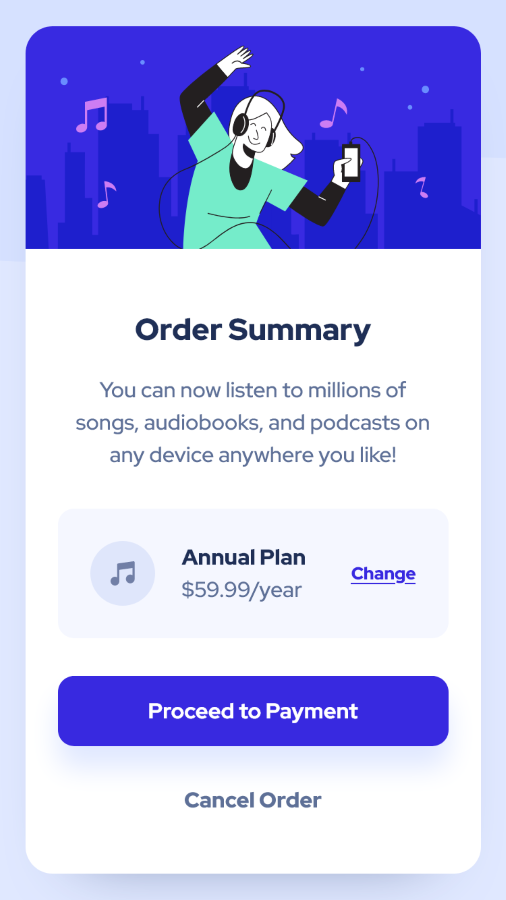

# Frontend Mentor - Order summary component solution

This is a solution to the [Order summary component challenge on Frontend Mentor](https://www.frontendmentor.io/challenges/order-summary-component-QlPmajDUj).

The card was created in a **mobile-first workflow** with **semantic HTML markup** and **Flexbox**. Text color contrast ratios follow **WCAG 2.0 level AA**. Its button has **hover and focus states** to provide feedback to the user and ensure great **tab navigation**.

## Overview

### The challenge

Users should be able to:

- See hover states for interactive elements

### Links

- [Solution on Frontend Mentor]()
- [Live Site on GitHub Pages]()

### Screenshots

|                                  Mobile                                   |     |                                   Desktop                                   |
| :-----------------------------------------------------------------------: | :-: | :-------------------------------------------------------------------------: |
|  |     |  |

## My process

### What I learned

In this project, I have practiced the following skills:

- Using **Flexbox** to create a card layout
- Using **CSS relative units** to ensure the text scales according to the user's font size settings
- Using **CSS custom properties** to allow easy customization and reusability of the card
- Using **media queries** to adapt the card's layout to larger screens
- Creating an **accessible** component by ensuring it uses **WCAG 2.0 level AA** contrast ratios in text
- Styling **buttons with different states**
- Styling elements with **box shadows**
- Positioning **background images**
- Using **Git** and **GitHub**

### Useful resources

- [_A Complete Guide to Links and Buttons_ — Chris Coyier (CSS-Tricks)](https://css-tricks.com/a-complete-guide-to-links-and-buttons/) - This guide covers many of the aspects that should be considered when working with links, buttons and button-like inputs.
- [Contrast Checker — WebAIM](https://webaim.org/resources/contrastchecker/) - An excellent tool that makes it easy to check if color contrast ratios meet WCAG.

## Author

- Frontend Mentor - [@JulioCinquina](https://www.frontendmentor.io/profile/JulioCinquina)
